<div class="bg-gray-dark">
  <h1 align="center">
    Desafio Star Wars ApiRest
  </h1>
</div>

<p align="center">
  <a href="https://www.linkedin.com/in/carloseac/">
    
  </a>

  

  <a href="https://github.com/CarlosEduAC/StarWars-WebApiRestWithNode/commits/main">
    
  </a>

  

  <a href="https://github.com/CarlosEduAC/Happy/stargazers">
    
  </a>
</p>

<div align="center">
  <sub>Desafio BackEnd B2W. Construído por
    <a href="https://github.com/CarlosEduAC">Carlos Eduardo Cardoso</a>
  </sub>
</div>

## :pushpin: Tabela de Conteúdo

<!-- * [Site de Demostração](#eyes-site-de-demostração)  -->
* [Sobre](#one-sobre-o-projeto)
* [Tecnologias](#two-tecnologias)
* [Funcionalidades](#three-funcionalidades)
* [Como rodar](#construction_worker-como-rodar)
* [Licencia](#closed_book-licencia)

## :one: Sobre o Projeto
Construção de uma API REST que contém os dados dos planetas da franquia Star Wars.
Para cada planeta se faz necessário obter o nome, clima e terreno inserido manualmente.
Além disso devemos ter a quantidade de aparições em filmes, que podem ser obtidas pela
API públic do [Star Wars](https://swapi.dev/about).

A estrutura do projeto é simples e seguindo boas práticas, porém preparada para adição de
conceitos como DDD e CQRS que permitem uma maior qualidade, escalabilidade, disponibilidade e entendimento do contexto do projeto.

## :two: Tecnologias
Esse projeto foi feito utilizando as seguintes tecnologias:

* [Typescript](https://www.typescriptlang.org/)
* [NodeJS](https://nodejs.org/en/)
* [MongoDB](https://www.mongodb.com/1)
* [Typeorm](https://typeorm.io/#/)
* [Express](https://expressjs.com/)
* [Swagger](https://swagger.io/)

## :three: Funcionalidades

API REST para manter uma coleção de planetas do universo Star Wars. Dando a possibilidade de:

* Adicionar um planeta
* Listar planetas
* Buscar por nome
* Buscar por ID
* Remover planeta
* Editar um planeta

Para facilitar na visualização, desemvolvimento e documentação da API, foi utilizado
o [Swagger](https://swagger.io/).

### :camera: Swagger Screenshot
<div style="display: flex; flex-direction: 'row'; align-items: 'center';">
  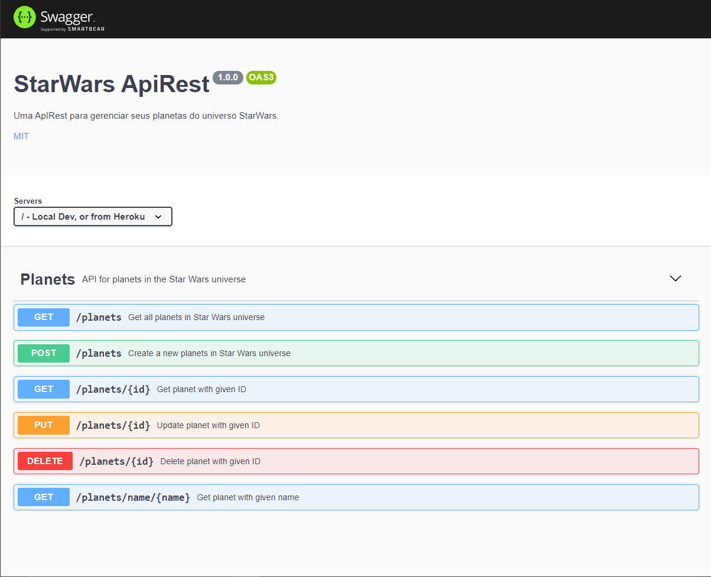
  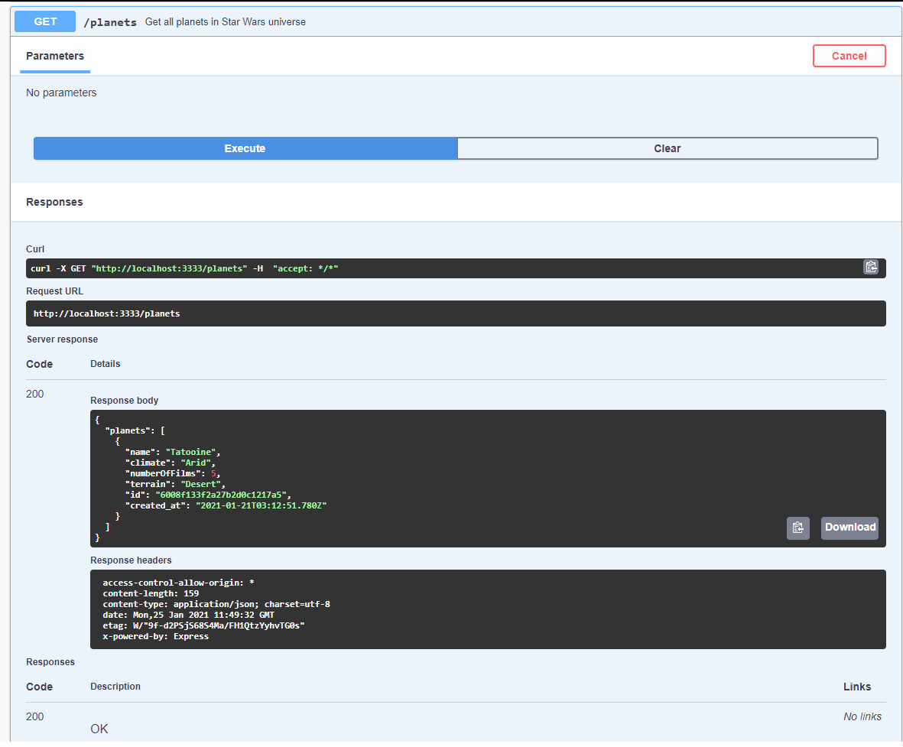
  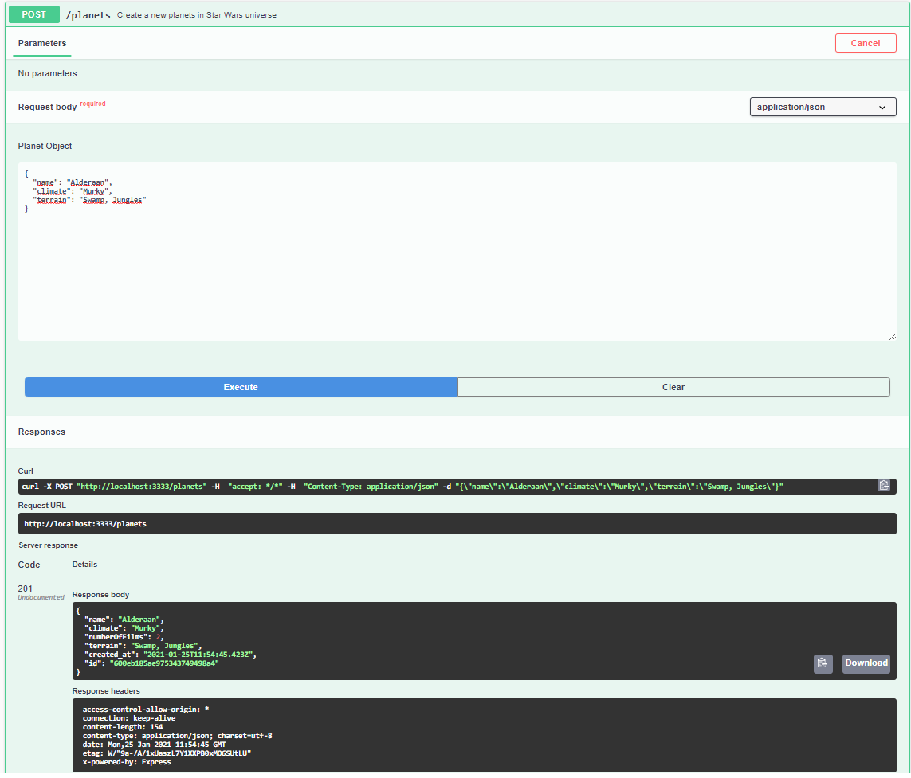
  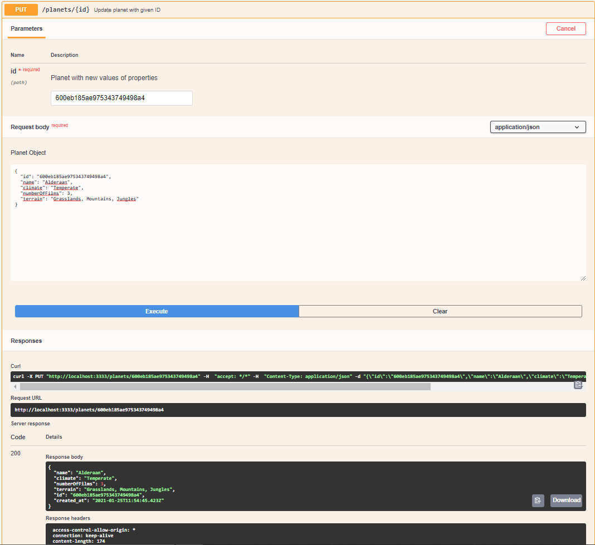
  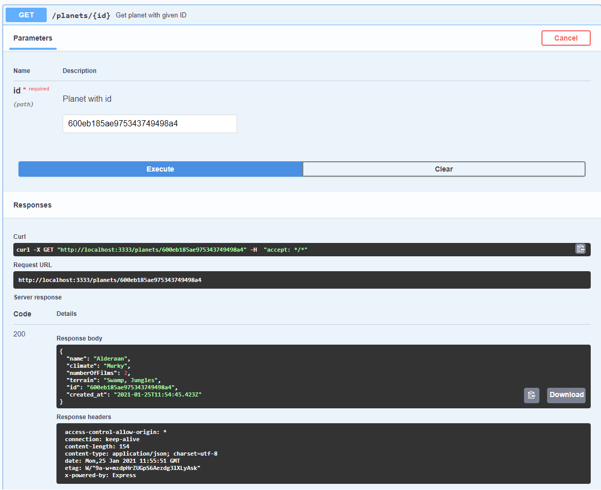
  
  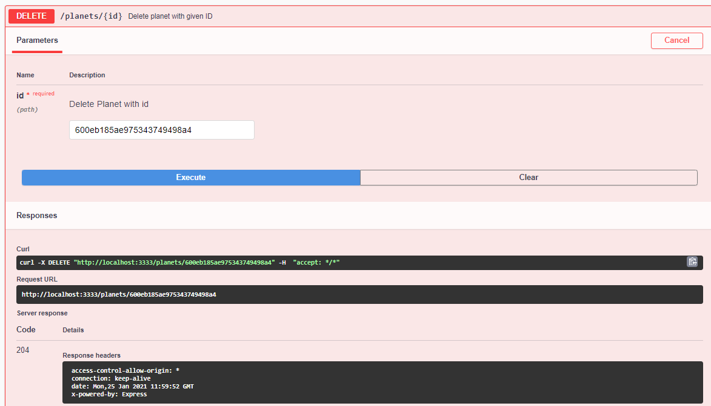
</div>

Uma outra opção é o [Insominia](https://insomnia.rest/), que diferente do [Swagger](https://swagger.io/) não necessita de nenhuma configuração no projeto para funcionar.

### :camera: Insominia Screenshot
<div style="display: flex; flex-direction: 'row'; align-items: 'center';">
  
  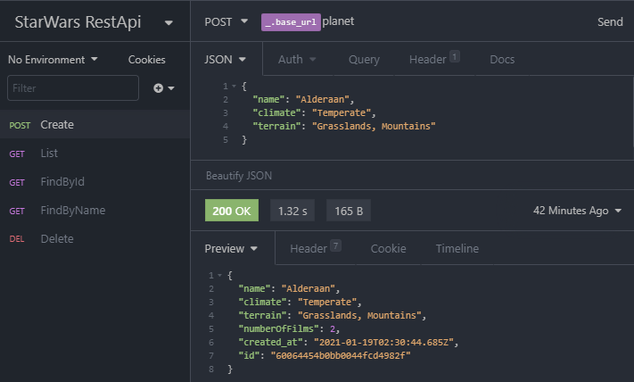
  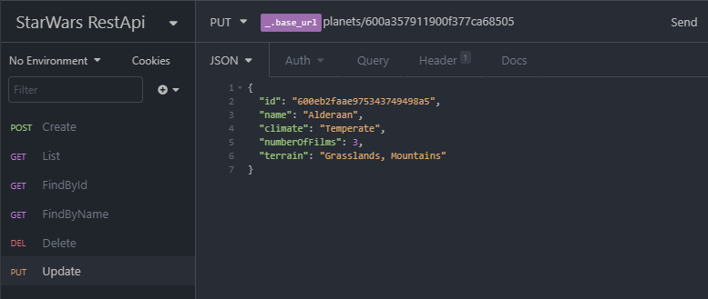
  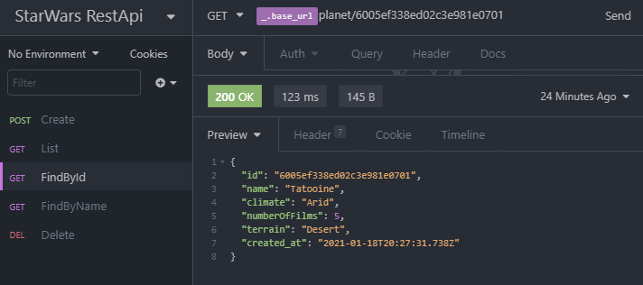
  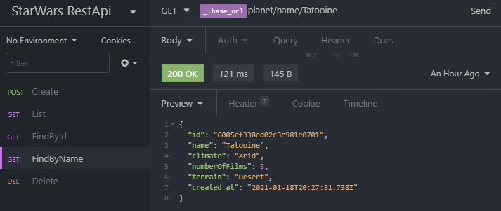
  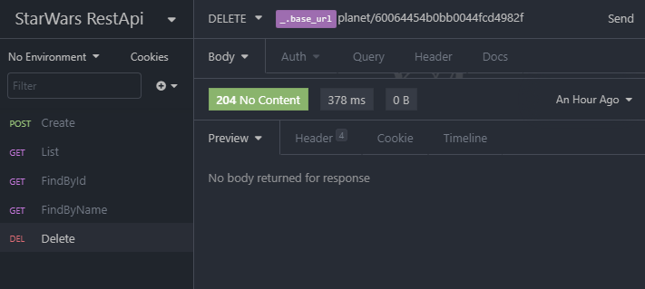
</div>

## :four: Como rodar

### :file_folder: Rode o Banco de dados

  Existem algumas formas de criar seu banco mongo e conectar com a aplicação.
  A primeira opção é criar localmente, e para isso precisamos instalar o mongodb
  na máquina. A segunda opção, é usar o docker. E por fim podemos usar um serviço
  na nuvem como o [MongoDB Atlas](https://www.mongodb.com/cloud/atlas/).

  Independente da opção utilizada se faz necessário criar um arquivo .env para criar
  as variáveis de ambiente usadas na API. Seu arquivo .env deve ter as seguintes variáveis:

  * PORT = <sua_porta_preferida>
  * MONGO_URL = <string_de_conexão>
  * MONGO_URL_TEST = <string_de_conexão_da_database_de_teste>
  * ENTITIES_DEVELOPMENT = "src/models/**/*.ts"

### 📦 Rode a API

```bash
# Clone o Repositoria
$ git clone https://github.com/CarlosEduAC/StarWars-WebApiRestWithNode.git
```

```bash
# Vá para a pasta do servidor
$ cd StarWars-ApiRest

# Instale as depedencias
$ yarn install

# Rode a aplicação
$ yarn dev:server
```
Acesse a API: http://localhost:3333/

### Testes

O Projeto conta com testes de integração e unitário.

Lembre de adicionar a variável de ambiente MONGO_URL_TEST.

```bash
# Rode os testes
$ yarn test
```

### :camera: Testes Screenshot
<div style="display: flex; flex-direction: 'row'; align-items: 'center';">
  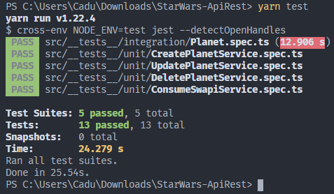
</div>

## :closed_book: Licencia

Lançado em 2021 :closed_book: Licencia

Construído por [Carlos Cardoso](https://github.com/CarlosEduAC) 🚀.
Esse projeto esta sobre [MIT license](./LICENSE).
