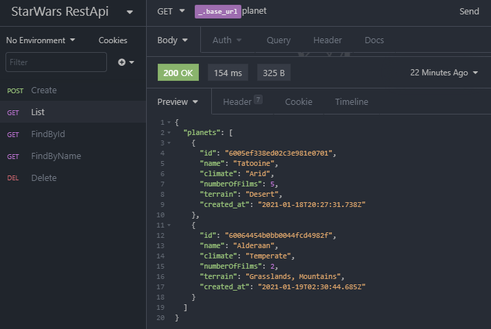

<div class="bg-gray-dark">
  <h1 align="center">
    Desafio Star Wars Node.js
  </h1>
</div>

<p align="center">
  <a href="https://www.linkedin.com/in/carloseac/">
    
  </a>

  

  <a href="https://github.com/CarlosEduAC/StarWars-WebApiRestWithNode/commits/main">
    
  </a>

  

  <a href="https://github.com/CarlosEduAC/Happy/stargazers">
    
  </a>
</p>

> :rocket: Uma API REST para manter uma coleção de planetas do universo Star Wars.

<div align="center">
  <sub>Desafio BackEnd B2W. Construído por
    <a href="https://github.com/CarlosEduAC">Carlos Eduardo Cardoso</a>
  </sub>
</div>

# :pushpin: Tabela de Conteúdo

<!-- * [Site de Demostração](#eyes-site-de-demostração)  -->
* [Tecnologias](#computer-tecnologias)
* [Funcionalidades](#rocket-funcionalidades)
* [Como rodar](#construction_worker-como-rodar)
* [Licencia](#closed_book-licencia)

# :computer: Tecnologias
Esse projeto foi feito utilizando as seguintes tecnologias:

* [Typescript](https://www.typescriptlang.org/)
* [NodeJS](https://nodejs.org/en/)
* [Typeorm](https://typeorm.io/#/)
* [Express](https://expressjs.com/)
* [MongoDB](https://www.mongodb.com/1)

# :rocket: Funcionalidades

* API REST para manter uma coleção de planetas do universo Star Wars.

### Funcionalidades Implementadas

* Adicionar um planeta
* Listar planetas
* Buscar por nome
* Buscar por ID
* Remover planeta

### Modelo de Dados

* Id (string)
* Nome (string)
* Clima (string)
* Terreno (string)
* Quantidade de Filmes (number)

### Insominia Screenshot
<div style="display: flex; flex-direction: 'row'; align-items: 'center';">
   
   
   
   
   
</div>

<!-- # :eyes: Site de Demostração
Você pode acessar o site em:
👉  demo: https://proffy-rafa.netlify.app/
-->

# :construction_worker: Como rodar
```bash
# Clone o Repositoria
$ git clone https://github.com/CarlosEduAC/StarWars-WebApiRestWithNode.git
```
### 📦 Rode a API

```bash
# Vá para a pasta do servidor
$ cd StarWars-WebApiRestWithNode

# Instale as depedencias
$ yarn install

# Rode a aplicação
$ yarn dev:server
```
Acesse a API: http://localhost:3333/

# :closed_book: Licencia

Lançado em 2021 :closed_book: Licencia

Construído por [Carlos Cardoso](https://github.com/CarlosEduAC) 🚀.
Esse projeto esta sobre [MIT license](./LICENSE).
